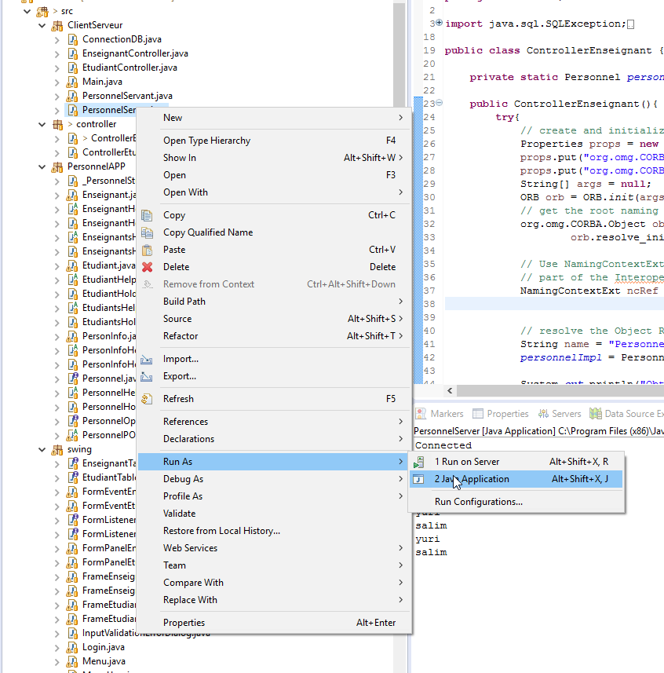

# CorbaPIF6004
Let's get old with CORBA for distributed application.
 * Clone the app on multiple machines.
 * change  hostname to your IPv4 address

## Goal:

Build a CRUD distributed application (Professor and Student) using Corba, Java and Swing

## Requirements:
 * Corba installed from eclipse( http://eclipsecorba.sourceforge.net/#Installation )
 
 * jdk1.8 or below
 
## Generate stub:

on the cli, go to source directory(src) of the project then:

`$ idlj -fall PersonnelAPP.idl`

## Starting the server:

Ensure you open the terminal with full credential (sudo..., as admin). Go to the bin folder of your `jdk` installation then (you may choose any port number ):

 `$ start orbd -ORBInitialPort 1000`
 
 Then right click on `PersonnelServer` Java class to start the server as in the image above:
 
  
 